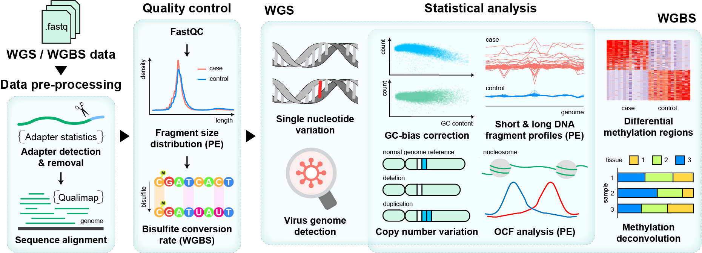
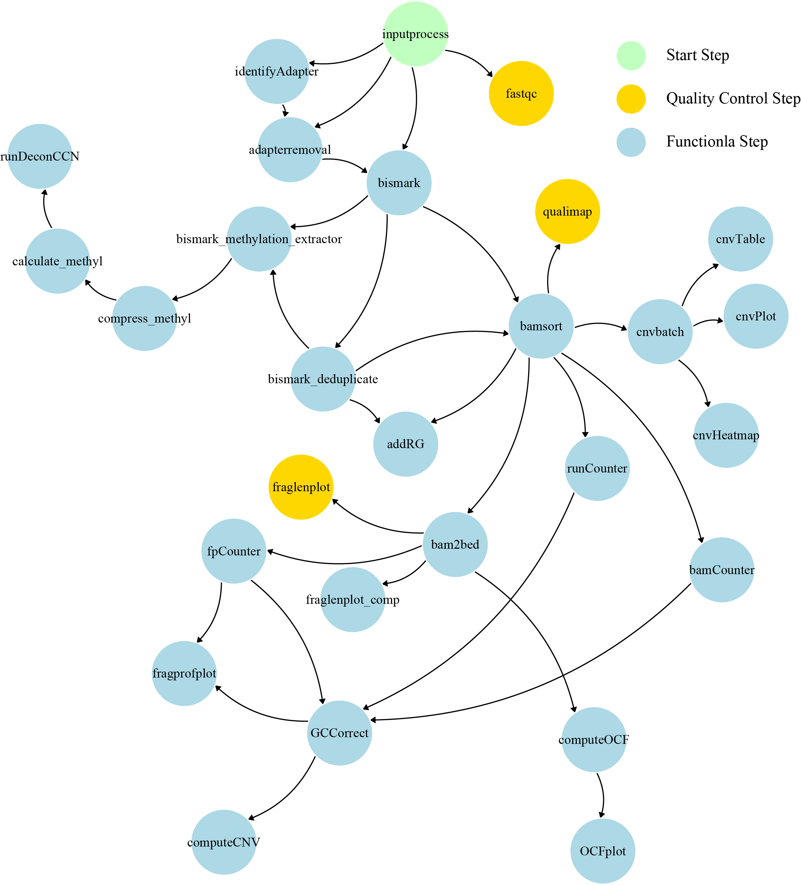
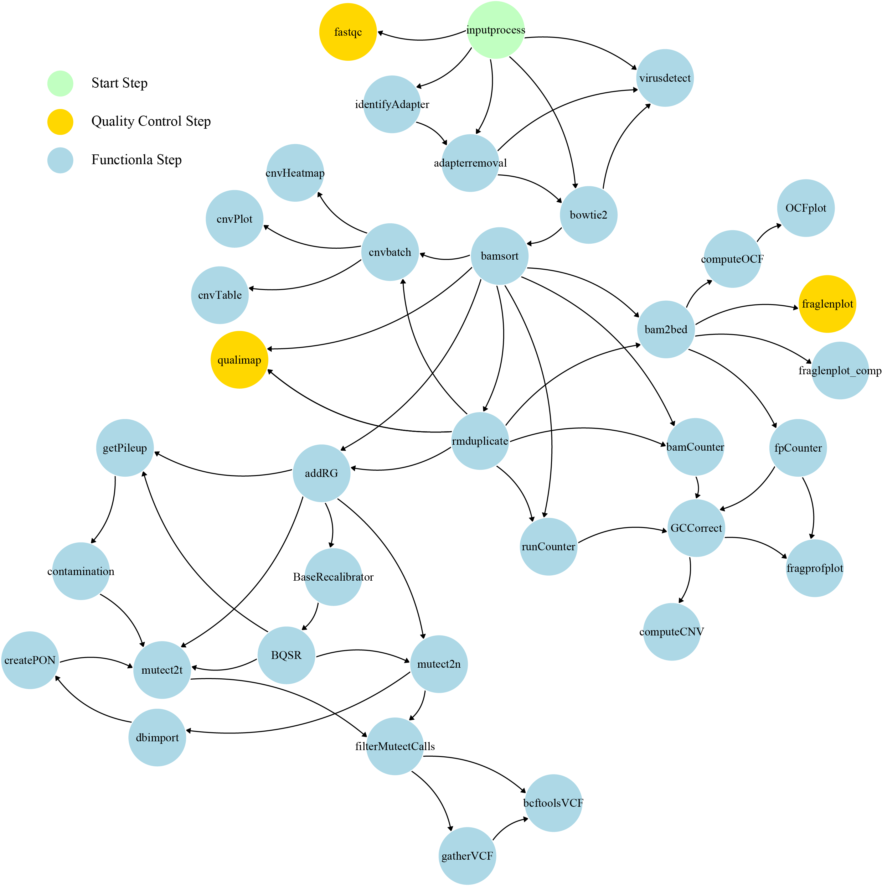
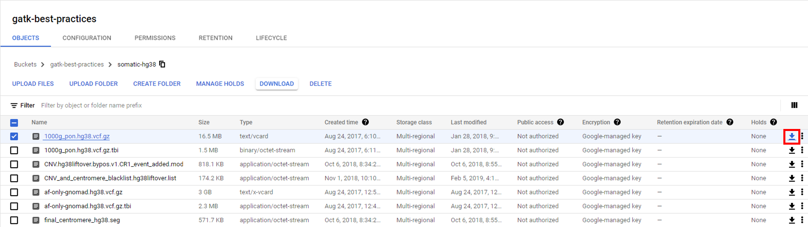

# cfDNApipe


* [Introduction](#introduction)
* [Section 1: Installation Tutorial](#section-1-installation-tutorial)
    * [Section 1.1: System requirement](#section-11-system-requirement)
    * [Section 1.2: Create environment and Install Dependencies](#section-12-create-environment-and-install-dependencies)
    * [Section 1.3: Activate Environment and Use cfDNApipe](#section-13-activate-environment-and-use-cfdnapipe)
* [Section 2: cfDNApipe Highlights](#section-2-cfdnapipe-highlights)
    * [Section 2.1: Dataflow Graph for WGS and WGBS Data Processing](#section-21-dataflow-graph-for-wgs-and-wgbs-data-processing)
    * [Section 2.2: Reference Auto Download and Building](#section-22-reference-auto-download-and-building)
    * [Section 2.3: Output Folder Arrangement](#section-23-output-folder-arrangement)
    * [Section 2.4: Breakpoint Detection](#section-24-breakpoint-detection)
    * [Section 2.5: Other Mechanisms](#section-25-other-mechanisms)
* [Section 3: A Quick Tutorial for Analysis WGBS data](#section-3-a-quick-tutorial-for-analysis-wgbs-data)
    * [Section 3.1: Set Global Reference Configures](#section-31-set-global-reference-configures)
    * [Section 3.2: Execute build-in WGBS Analysis Pipeline](#section-32-execute-build-in-wgbs-analysis-pipeline)
* [Section 4: Perform Case-Control Analysis for WGBS data](#section-4-perform-case-control-analysis-for-wgbs-data)
* [Section 5: How to Build Customized Pipepline using cfDNApipe](#section-5-how-to-build-customized-pipepline-using-cfdnapipe)
* [Section 6: Additional function: WGS SNV/InDel Analysis](#section-6-additional-function-wgs-snvindel-analysis)
    * [Section 6.1: Reference Files Preparation](#section-61-reference-files-preparation)
    * [Section 6.2: Performing Single Group Samples SNV Analysis](#section-62-performing-single-group-samples-snv-analysis)
    * [Section 6.3: Performing Case-Control SNV Analysis](#section-63-performing-case-control-snv-analysis)
* [Section 7: Additional Function: Virus Detection](#section-7-additional-function-virus-detection)
* [FAQ](#faq)


Links:

- [cfDNApipe documentaion](https://cfdnapipe-doc.readthedocs.io/en/latest/)
- [codes for pipeline test](https://github.com/XWangLabTHU/cfDNApipe/tree/master/demo/pipeline_test)
- [codes for functional test](https://github.com/XWangLabTHU/cfDNApipe/tree/master/demo/functional_test)
- [demo report](https://xwanglabthu.github.io/cfDNApipe/demo/report_result/Cell_Free_DNA_WGBS_Analysis_Report.html)
- [cfDNA test data (google drive)](https://drive.google.com/drive/folders/1c01w_lzPPIqdzMgkeQVgZ_F6tzh2xMtl?usp=sharing)


## Introduction

**cfDNApipe(<u>c</u>ell <u>f</u>ree <u>DNA</u> <u>Pipe</u>line)** is an integrated pipeline for analyzing [cell-free DNA](https://en.wikipedia.org/wiki/Circulating_free_DNA) WGBS/WGS data. It contains many cfDNA quality control and statistical algorithms. Also we collected some useful cell free DNA references and provided them [here](https://honchkrow.github.io/cfDNAReferences/).Users can access the cfDNApipe documentation [Here](https://cfdnapipe-doc.readthedocs.io/en/latest/).

The whole pipeline is established based on processing graph principle. Users can use the preset pipeline for WGBS/WGS data as well as build their own analysis pipeline from any intermediate data like bam files. The main functions are as the following picture.

<center>
    
    <br>
    <div style="color:orange; border-bottom: 1px solid #d9d9d9;
    display: inline-block;
    color: #999;
    padding: 2px;">cfDNApipe Functions</div>
</center>


## Section 1: Installation Tutorial

### Section 1.1: System requirement

The popular WGBS/WGS analysis softwares are released on Unix/Linux system, based on different program language, like FASTQC and Bowtie2. Therefore, it's very difficult to rewrite all the software in one language. Fortunately, [conda](https://docs.conda.io/en/latest/)/[bioconda](http://bioconda.github.io/) program collected many prevalent python mudules and bioinformatics software, so we can install all the dependencies through [conda](https://docs.conda.io/en/latest/)/[bioconda](http://bioconda.github.io/) and arrange pipelines using python.

We recommend using [conda/Anaconda](https://www.anaconda.com/) and create an virtual environment to manage all the dependencies. If you did not install conda before, please follow [this tutorial](https://xwanglabthu.github.io/cfDNApipe/docs/conda_installation.html) to install conda first.

After installation, you can create a new virtual environment for cfDNA analysis. Virtual environment management means that you can install all the dependencies in this virtual environment and delete them easily by removing this virtual environment.

### Section 1.2: Create environment and Install Dependencies

We tested our pipeline using different version of software and provide an  environment yml file for users. Users can download this file and create the environment in one command line. 

First, please download the yml file.

``` shell
wget https://xwanglabthu.github.io/cfDNApipe/environment.yml
```

Then, run the following command. The environment will be created and all the dependencies as well as the latest cfDNApipe will be installed.

``` shell
# clean before installation
conda clean -y --all

# install environment
conda env create -n cfDNApipe -f environment.yml
```

*<font color=red>Note:</font> The environment name can be changed by replacing "-n cfDNApipe" to "-n environment_name".*

*<font color=red>Note:</font> If errors about unavailable or invalid channel occur, please check that whether the .condarc file in your ~ directory had been modified. Modifing .condarc file may cause wrong channel error. In this case, just rename/backup your .condarc file. Once the installation finished, this file can be recoveried. Of course, you can delete .condarc file if necessary.*

### Section 1.3: Activate Environment and Use cfDNApipe

Once the environment is created, user can enter environment using the foloowing command.

``` shell
conda activate cfDNApipe
```

 Now, just open python and process **cell free DNA WGBS/WGS paired/single end** data. For more detailed explanation for each function and parameters, please see [cfDNApipe documentation](https://cfdnapipe-doc.readthedocs.io/en/latest/).


## Section 2: cfDNApipe Highlights

cfDNApipe is a highly integrated cfDNA WGS/WGBS data processing pipeline. We designed many useful build-in mechanism. Here, we will introduce some important features.

### Section 2.1: Dataflow Graph for WGS and WGBS Data Processing

cfDNApipe is organized by a built-in dataflow with strictly defined up- and down-stream data interface. The following two figures shows the up- and down-stream relationship between functions in WGS and WGBS data processing.

<br/>

<center>
    
    <br>
    <div style="color:orange; border-bottom: 1px solid #d9d9d9;
    display: inline-block;
    color: #999;
    padding: 2px;">WGBS Dataflow Overview</div>
</center>

<br/>

<center>
    
    <br>
    <div style="color:orange; border-bottom: 1px solid #d9d9d9;
    display: inline-block;
    color: #999;
    padding: 2px;">WGS Dataflow Overview</div>
</center>

### Section 2.2: Reference Auto Download and Building

For any HTS data analysis, the initial step is to set reference files like genome sequence and annotation files. Here, we introduced global reference configure function in cfDNApipe to download and build reference files automatically.

cfDNApipe contains 2 types of global reference configure function, **pipeConfigure** and **pipeConfigure2**. Function **pipeConfigure** is for single group data analysis (without control group). Function **pipeConfigure2** is for case and control analysis. Either function will check the reference files, such as bowtie2 and bismark references. If not detected, references will be downloaded and built. This step is **<font color=red>necessary</font>** and puts things right once and for all.

*<font color=red>Note:</font> Users should use the correct configure function **pipeConfigure** and **pipeConfigure2**. The output folder arrangement stategy is totally different for these two function. In addition, some default files can only be accessed through pipeConfigure or pipeConfigure2. Therefore, if a single group data analysis is needed, using **pipeConfigure** and **Configure**. If a case-control comparison analysis is needed, using **pipeConfigure2** and **Configure2**. If users want to switch analysis from single group to case-control group and vice versa, the customized pipeline can achieve the seamless linking between output and input of different functions.*

The folowing is a simple **pipeConfigure** example for building WGBS reference files.

```Python
from cfDNApipe import *

pipeConfigure(
    threads=60,
    genome="hg19",
    refdir=r"path_to_reference/hg19_bismark",
    outdir=r"path_to_output/WGBS",
    data="WGBS",
    type="paired",
    JavaMem="10g",
    build=True,
)

```

pipeConfigure function takes 8 necessary parameters as input. 

* **'threads'**: the max threads user want to be used. 
* **'genome'**: which genome to be used, must be 'hg19' or 'hg38'. 
* **'refdir'**: where to find genome reference files like sequence fasta file and CpG island ananotation files. 
* **'outdir'**: where to put all the output files.
* **'data'**: "WGBS" or "WGS".
* **'type'**: "paired" or "single".
* **'JavaMem'**: maximum memory java program can used.
* **'build'**: download and build reference or not after reference checking.

Like the above example, if refdir is empty, cfDNApipe will download hg19.fa and other annotation files automatically. Once done, the program will print "Background reference check finished!", then users can do the analyzing steps.

*<font color=red>Note:</font> The download procedure is always time-consuming. cfDNApipe can detect the reference files which are already existed in refdir. Therefore, users can employ already established reference without rebuilding. For instance, users can just put hg19.fa and bowtie2 related files into refdir and cfDNApipe will not download and rebuild them again. Other reference files can be got from [here](https://github.com/Honchkrow/cfDNAReferences). Downlaoding, uncompressing and putting them into refdir will be much faster.

We also provide a simple **pipeConfigure2** example for building WGBS reference files.

```Python
from cfDNApipe import *

pipeConfigure2(
    threads=60,
    genome="hg19",
    refdir=r"path_to_reference/hg19_bismark",
    outdir=r"path_to_output/WGBS",
    data="WGBS",
    type="paired",
    case="cancer",
    ctrl="normal",
    JavaMem="10g",
    build=True,
)

```

* **'case'**: Case group name flag.
* **'ctrl'**: Control group name flag.


### Section 2.3: Output Folder Arrangement

Generally, the cell free DNA analysis contains many steps, which will generate lots of output files. cfDNApipe arrange the outputs into every functinal specific folders. Based on analysis stategy (with or without control), the output folders are arranged as follows.

- Analysis Results Without Control Samples

``` 
output_folders/  
├── final_result/  
├── report_result/  
│   ├── Cell_Free_DNA_WGBS_Analysis_Report.html  
│   └── Other files and folders  
└── intermediate_result/  
    ├── step_01_inputprocess  
    ├── step_02_fastqc  
    ├── step_02_identifyAdapter  
    └── Other processing folders  
```

- Analysis Results With Control Samples (assume case and control)

``` 
output_folders/
├──case/
│   ├── final_result/  
│   ├── report_result/  
│   │   ├── Analysis_Report.html  
│   │   └── Other files and folders  
│   └── intermediate_result/  
│       ├── step_01_inputprocess  
│       ├── step_02_fastqc  
│       ├── step_02_identifyAdapter  
│       └── Other processing folders  
├──control/
    ├── final_result/  
    ├── report_result/  
    │   ├── Analysis_Report.html  
    │   └── Other files and folders  
    └── intermediate_result/  
        ├── step_01_inputprocess  
        ├── step_02_fastqc  
        ├── step_02_identifyAdapter  
        └── Other processing folders  
```

There will be 3 major ouput folder for every sample group, named **"intermediate_result"**, **"report_result"**, and **"final_result"**. 

Folder **"intermediate_result"** contains folders named by every single step, all the intermediate results and processing record will be save in each folder. User can accsee any files they want. This folder is evry large since all the intermediate files are saved in this folder. Users can move some results to the folder **"final_result"** and deleted **"intermediate_result"** after all the analysis is finished.

Folder **"report_result"** save a pretty html report and related data which shows some visualization results like quality control and analysis figures. The report folder can be copied to any where. Here is an [example](https://xwanglabthu.github.io/cfDNApipe/demo/report_result/Cell_Free_DNA_WGBS_Analysis_Report.html) showing the final report.

Folder **"final_result"** is an empty folder for users to save specific results from intermediate_result folder.

### Section 2.4: Breakpoint Detection

Sometimes, the program may be interrupted by irresistible reasons like computer crash. cfDNApipe provide **breakpoint detection mechanism**, which compute md5 code for inputs, outputs, as well as all parameters. Therefore, user do not warry about any interrupt situation. Re-running the same program, the finished step will show message like below and be skipped automatically.

``` shell
************************************************************
                bowtie2 has been completed!
************************************************************
```

### Section 2.5: Other Mechanisms

* Parallel Computing
* Case and Control Analysis
* Inputs Legality Checking
* ......

## Section 3: A Quick Tutorial for Analysis WGBS data

In this section, we will demonstrate how to perform a quick analysis for paired end WGBS data using the build-in pipeline.

### Section 3.1: Set Global Reference Configures

First, user must set some important configure, for example, which genome to be used, how many threads should be used and where to put the analysis results. cfDNApipe provide a configure function for user to set these parameters. Below is an instance.

``` Python
from cfDNApipe import *

pipeConfigure(
    threads=60,
    genome="hg19",
    refdir=r"path_to_reference/hg19_bismark",
    outdir=r"path_to_output/WGBS",
    data="WGBS",
    type="paired",
    build=True,
    JavaMem="10g",
)
```


### Section 3.2: Execute build-in WGBS Analysis Pipeline

cfDNApipe provides an preset pipeline for paired/single end WGBS/WGS data, user can use it easily by assigning fastq sequencing files as the input of the pipeline. All the parameters used in pipeline are carefully selected after numerous tests.

``` Python
res = cfDNAWGBS(inputFolder=r"path_to_fastqs",
                idAdapter=True,
                rmAdapter=True,
                dudup=True,
                CNV=False,
                armCNV=False,
                fragProfile=False,
                report=True,
                verbose=False)

# see all outputs
print(res)

# get a specific step
res.bismark

# output like below
<cfDNApipe.Fun_bismark.bismark object at 0x7effb860f438>

# get all output of a step
res.bismark.getOutputs()

# output like below
['outputdir', 'unmapped-1', 'unmapped-2', 'bamOutput', 'bismkRepOutput']

# get a spefic output
res.bismark.getOutput('bamOutput')

# output like below
[
'/opt/tsinghua/zhangwei/Pipeline_test/o_WGBS-PE/intermediate_result/step_04_bismark/case1.pair1.truncated.gz_bismark_bt2_pe.bam', 
'/opt/tsinghua/zhangwei/Pipeline_test/o_WGBS-PE/intermediate_result/step_04_bismark/case2.pair1.truncated.gz_bismark_bt2_pe.bam', 
'/opt/tsinghua/zhangwei/Pipeline_test/o_WGBS-PE/intermediate_result/step_04_bismark/case3.pair1.truncated.gz_bismark_bt2_pe.bam', 
'/opt/tsinghua/zhangwei/Pipeline_test/o_WGBS-PE/intermediate_result/step_04_bismark/case4.pair1.truncated.gz_bismark_bt2_pe.bam'
]
# 
```

In the above example, user just pass the input folder which contains all the raw fastq files **(wothout any other files)** to the function, then the processing will start and all results will be saved in output folder mentioned in the former section. What's more, "report=True" will generate a html report for users.

In addition, cfDNApipe also provides **case-control** comparison analysis for WGBS/WGS data. For using this function, please see the section 4 and function **cfDNAWGS2** and **cfDNAWGBS2**.


## Section 4: Perform Case-Control Analysis for WGBS data

The analysis steps for case-control analysis are the same as section 3.1 and 3.2. First, set global configure. Second, run analysis command.

Setting global configure is a little bit different from section 3.1. Below is an example.

``` Python
from cfDNApipe import *

pipeConfigure2(
    threads=60,
    genome="hg19",
    refdir=r"path_to_reference/hg19_bismark",
    outdir=r"path_to_output/WGBS",
    data="WGBS",
    type="paired",
    JavaMem="10G",
    case="cancer",
    ctrl="normal",
    build=True,
)
```

Here, two more parameters are used. Parameter **"case"** and **"ctrl"** is the name flag for case and control data. These two parameters control the output for case and control samples.

Next, using function **cfDNAWGBS2** to processing case and control analysis.

``` Python
case, ctrl, comp = cfDNAWGBS2(
    caseFolder=r"case_fastqs",
    ctrlFolder=r"ctrl_fastqs",
    caseName="cancer",
    ctrlName="normal",
    idAdapter=True,
    rmAdapter=True,
    dudup=True,
    armCNV=True,
    CNV=True,
    fragProfile=True,
    verbose=False,
)
```

After analysis, user can get all the output as well as reports for case and control. Of course, the comparison results will be saved in **case folder**.

If you want build <font color=red>customized</font> pipeline in a case-control study, please use **switchConfigure** before any operation. **switchConfigure** function tells the program that the following steps should be saved in case or control specific folders. Below is a small demostration. For a more detailed example, please see Section 6.3.

``` Python
from cfDNApipe import *

# set all configures
pipeConfigure2(
    threads=60,
    genome="hg19",
    refdir=r"path_to_reference/hg19_bismark",
    outdir=r"path_to_output/WGBS",
    data="WGBS",
    type="paired",
    JavaMem="10G",
    case="cancer",
    ctrl="normal",
    build=True,
)

# switch to normal folder. If pipeConfigure2 is set but not calling any switchConfigure, there will report an error.
switchConfigure("normal")

# Here, do the analysis for normal samples

# switch to cancer folder. Without switchConfigure("cancer"), the analysis of cancer samples will saved in normal folder.
switchConfigure("cancer")

# Here, do the analysis for cancer samples

# switchConfigure can be used many time.
switchConfigure("normal")


switchConfigure("cancer")
```


## Section 5: How to Build Customized Pipepline using cfDNApipe

Some users are familiar with cfDNA processing and want to customize their own pipelines. cfDNApipe provide a flexible pipeline framework for building customized pipeline. The following is an example of how to build pipeline from intermediate steps.

Assume that we have some WGS samples and all the samples have already been aligned. Now, we want to perform CNA analysis to these data compared with default sequence and get gene level annotation.

First, set global configure.

``` Python
from cfDNApipe import *
import glob

pipeConfigure(
    threads=60,
    genome="hg19",
    refdir=r"path_to_reference/hg19_bowtie2",
    outdir=r"path_to_output/WGS",
    data="WGS",
    type="paired",
    JavaMem="10G",
    build=True,
)
```

Second, take all the aligned bam as inputs.

``` Python
# get all bam files
bams = glob.glob("samples/*.bam")

# sort bam and remove duplicates
res_bamsort = bamsort(bamInput=bams, upstream=True)
res_rmduplicate = rmduplicate(upstream=res_bamsort)

# perform CNV analysis, stepNum is set as flag of every step
res_cnvbatch = cnvbatch(
    caseupstream=res_rmduplicate,
    access=Configure.getConfig("access-mappable"),
    annotate=Configure.getConfig("refFlat"),
    stepNum="CNV01",
)
res_cnvPlot = cnvPlot(upstream=res_cnvbatch, stepNum="CNV02")
res_cnvTable = cnvTable(upstream=res_cnvbatch, stepNum="CNV03")
res_cnvHeatmap = cnvHeatmap(upstream=res_cnvbatch, stepNum="CNV04")
```

In the above codes, **"upstream=True"** means puts all the results to the well-arranged output folder.

Also, sophisticated users can change computational resources in every step using **Configure** (for single group samples) and **Configure2** (for case-control samples) like below.

```python
# see all methods in Configure
dir(Configure)

# output like below
['_Configure__config', '__class__', '__delattr__', '__dict__', 
'__dir__', '__doc__', '__eq__', '__format__', '__ge__', '__getattribute__', 
'__gt__', '__hash__', '__init__', '__init_subclass__', '__le__', '__lt__', 
'__module__', '__ne__', '__new__', '__reduce__', '__reduce_ex__', 
'__repr__', '__setattr__', '__sizeof__', '__str__', '__subclasshook__', 
'__weakref__', 'bismkrefcheck', 'bt2refcheck', 'checkFolderPath', 
'configureCheck', 'genomeRefCheck', 'getConfig', 'getConfigs', 'getData', 
'getFinalDir', 'getGenome', 'getJavaMem', 'getOutDir', 'getRefDir', 
'getRepDir', 'getThreads', 'getTmpDir', 'getTmpPath', 'getType', 
'gitOverAllCheck', 'githubIOFile', 'pipeFolderInit', 'refCheck', 
'setConfig', 'setData', 'setGenome', 'setJavaMem', 'setOutDir', 
'setRefDir', 'setThreads', 'setType', 'snvRefCheck', 'virusGenomeCheck']

# get all parameters
Configure.getConfigs()

# output like below
dict_keys(['threads', 'genome', 'refdir', 'outdir', 'tmpdir', 'finaldir', 
'repdir', 'data', 'type', 'JavaMem', 'genome.seq', 'genome.idx.fai', 
'genome.idx.dict', 'chromSizes', 'CpGisland', 'cytoBand', 'OCF', 
'PlasmaMarker', 'Blacklist', 'Gaps', 'refFlat', 'access-mappable'])

# change threads
Configure.setThreads(20)

# change threads in another way
Configure.setConfig("threads", 20)
```


## Section 6: Additional function: WGS SNV/InDel Analysis

*<font color=red>Note:</font> This function is <font color=red>only</font> supported for processing WGS data.*

We wrapped classical software [**GATK4**](https://gatk.broadinstitute.org/hc/en-us) to call WGS mutations. Detecting mutations needs addtional references related to human genome. These references are provided by [GATK resource bundle](https://gatk.broadinstitute.org/hc/en-us/articles/360035890811-Resource-bundle) and not suit for auto-downloading. Therfore, users should download the reference files manually. [GATK resource bundle](https://gatk.broadinstitute.org/hc/en-us/articles/360035890811-Resource-bundle) provides different ways to download reference files like lftp and ftp. We recommend using **lftp** to download the VCF references for convenient.

If **lftp** is not installed, users can install it from conda easily.

```shell
conda install -c conda-forge lftp
```

Before the analysis, we recommend users to create a new folder for saving the snv related referencef files. For example, create a folder in your genome reference folder and name it based on the genome version like hg19_snv or hg38_snv. Then, enter the folder to download the snv reference files.

### Section 6.1: Reference Files Preparation

Users can login in GATK resource bundle and download the dependent VCF files.

```shell
lftp gsapubftp-anonymous@ftp.broadinstitute.org:/
#just click "Enter" for password
lftp gsapubftp-anonymous@ftp.broadinstitute.org:/> ls
```

Data hosted in GATK resource bundle is shown as follows.

```shell
drwxrwxr-x  12 ebanks   wga           235 Jul 30  2018 bundle
drwxrwxr-x   2 ebanks   wga           219 Nov 28  2011 DePristoNatGenet2011
drwxr-xr-x   2 droazen  broad         253 Oct 24  2014 foghorn140
-rw-r--r--   1 vdauwera broad     2141164 Jul 15  2014 gatkdocs-3_1_v_3_2.zip
drwxrwxr-x   2 ebanks   wga            34 Aug 12  2011 HLA
drwxrwxr-x   2 ebanks   wga           293 May 21  2019 Liftover_Chain_Files
-rw-r--r--   1 vdauwera broad    11645558 Aug  3  2017 mutect-1.1.7.jar
-rw-r--r--   1 vdauwera broad    10547264 Aug  3  2017 mutect-1.1.7.jar.zip
drwxrwxr-x   2 thibault broad         169 May 11  2015 travis
drwxrwxr-x   4 ebanks   wga            71 Aug  7  2016 triosForGA4GH
-rw-rw-r--   1 vdauwera broad    739681240 Oct 22  2013 tutorial_files.zip
drwxrwxr-x   7 vdauwera broad         126 Aug  3  2017 tutorials
drwxrwxr-x   5 vdauwera broad          72 Jun 24  2016 workshops
```

Then download the dependent files based on related genome version.

For **hg19**:

*<font color=red>Note:</font> Some files for hg19 is not provided by GATK, therefore we should convert them from b37 version. cfDNApipe will do the conversion <font color=red>automatically</font>.*

```shell
glob -- pget -c -n 12 bundle/hg19/1000G_omni2.5.hg19.sites.vcf.gz
glob -- pget -c -n 12 bundle/hg19/1000G_phase1.indels.hg19.sites.vcf.gz
glob -- pget -c -n 12 bundle/hg19/1000G_phase1.snps.high_confidence.hg19.sites.vcf.gz
glob -- pget -c -n 12 bundle/hg19/dbsnp_138.hg19.vcf.gz
glob -- pget -c -n 12 bundle/hg19/Mills_and_1000G_gold_standard.indels.hg19.sites.vcf.gz
glob -- pget -c -n 12 bundle/Mutect2/af-only-gnomad.raw.sites.b37.vcf.gz
glob -- pget -c -n 12 bundle/Mutect2/GetPileupSummaries/small_exac_common_3_b37.vcf.gz
glob -- pget -c -n 12 Liftover_Chain_Files/b37tohg19.chain
```

For **hg38**:

```shell
glob -- pget -c -n 12 bundle/hg38/1000G_omni2.5.hg38.vcf.gz
glob -- pget -c -n 12 bundle/hg38/1000G_phase1.snps.high_confidence.hg38.vcf.gz
glob -- pget -c -n 12 bundle/hg38/dbsnp_146.hg38.vcf.gz
glob -- pget -c -n 12 bundle/hg38/hapmap_3.3.hg38.vcf.gz
glob -- pget -c -n 12 bundle/hg38/Mills_and_1000G_gold_standard.indels.hg38.vcf.gz
glob -- pget -c -n 12 bundle/Mutect2/af-only-gnomad.hg38.vcf.gz.gz
glob -- pget -c -n 12 bundle/Mutect2/GetPileupSummaries/small_exac_common_3.hg38.vcf.gz
```

For analyzing **single group samples**, we need [Public GATK Panel of Normals](https://gatk.broadinstitute.org/hc/en-us/articles/360035890631-Panel-of-Normals-PON-) (PON) file. Here we provide the google storage download address directly.

For **hg19**, [somatic-b37_Mutect2-WGS-panel-b37.vcf](https://console.cloud.google.com/storage/browser/gatk-best-practices/somatic-b37;tab=objects?prefix=&forceOnObjectsSortingFiltering=false).


<center>
    
    <br>
    <div style="color:orange; border-bottom: 1px solid #d9d9d9;
    display: inline-block;
    color: #999;
    padding: 2px;">click the dwonload button in red mark</div>
</center>

<br/>

For **hg38**, [somatic-hg38_1000g_pon.hg38.vcf.gz](https://console.cloud.google.com/storage/browser/gatk-best-practices/somatic-hg38;tab=objects?prefix=&forceOnObjectsSortingFiltering=false).

<center>
    
    <br>
    <div style="color:orange; border-bottom: 1px solid #d9d9d9;
    display: inline-block;
    color: #999;
    padding: 2px;">click the dwonload button in red mark</div>
</center>

<br/>

Just put the PON file in the same folder as the other snv reference files download before.

Finally, uncompressing all the files.

``` shell 
gunzip *.gz
```

### Section 6.2: Performing Single Group Samples SNV Analysis

When finish preparing all the files, we can use "snvRefCheck" function in cfDNApipe to achieve genome version conversion from b37 to hg19 and indexing. Here we use hg19 to show the demo for single group samples SNV analysis.

The following are the whole scripts for single group samples SNV analysis with annotations.

```Python
from cfDNApipe import *
import glob

pipeConfigure(
    threads=60,
    genome="hg19",
    refdir=r"path_to_reference/hg19",
    outdir=r"path_to_output/snv_output",
    data="WGS",
    type="paired",
    build=True,
    JavaMem="10G",
)

# just set build=True to finish all the works
Configure.snvRefCheck(folder="path_to_reference/hg19/hg19_snv", build=True)

# see all the SNV related files
Configure.getConfig("snv.folder")
Configure.getConfig("snv.ref")

# indexed bam files after remove duplicates
bams = glob.glob("path_to_samples/*.bam")

res1 = addRG(bamInput=bams, upstream=True)

res2 = BaseRecalibrator(
    upstream=res1, knownSitesDir=Configure.getConfig("snv.folder")
)
res3 = BQSR(upstream=res2)

res4 = getPileup(
    upstream=res3,
    biallelicvcfInput=Configure.getConfig('snv.ref')["7"],
)

res5 = contamination(upstream=res4)

# In this step, files are split to chromatin
res6 = mutect2t(
    caseupstream = res5,
    vcfInput=Configure.getConfig('snv.ref')["6"],
    ponbedInput=Configure.getConfig('snv.ref')["8"],
)

# 
res7 = filterMutectCalls(upstream=res6)

# put all chromatin files together
res8 = gatherVCF(upstream=res7)

# split somatic mutations
res9 = bcftoolsVCF(upstream=res8, stepNum="somatic")

# split germline mutations
res10 = bcftoolsVCF(
    upstream=res8, other_params={"-f": "'germline'"}, suffix="germline", stepNum="germline"
)

```


*<font color=red>Note:</font> User can adjust the parameter <font color=red>"--f-score-beta"</font> in function <font color=red>filterMutectCalls</font> for a very strict filtering. For detailed information, please see [filterMutectCalls manual](https://gatk.broadinstitute.org/hc/en-us/articles/360037225412-FilterMutectCalls).*

The output vcf file from function <font color=blue>bcftoolsVCF</font> can be annotated by other software such as [annovar](https://doc-openbio.readthedocs.io/projects/annovar/en/latest/). Also, users can use [IGV](http://software.broadinstitute.org/software/igv/) to visualize SNV in genome (link:[Inspecting Variants in IGV](https://bioinformatics-core-shared-training.github.io/intro-to-IGV/InspectingVariantsInIGV.html)). 

### Section 6.3: Performing Case-Control SNV Analysis

Here we also use hg19 to show the demo for case-control SNV analysis.

```Python
from cfDNApipe import *
import glob

# set global configure
pipeConfigure2(
    threads=100,
    genome="hg19",
    refdir=r"path_to_reference/hg19",
    outdir=r"path_to_output/snv_output",
    data="WGS",
    type="paired",
    case="cancer",
    ctrl="normal",
    JavaMem="10g",
    build=True,
)

Configure2.snvRefCheck(folder="path_to_reference/hg19/SNV_hg19", build=True)

case_bams = glob.glob("path_to_samples/cancer/*.bam")
ctrl_bams = glob.glob("path_to_samples/normal/*.bam")

# create PON file from normal samples
switchConfigure("normal")

ctrl_addRG = addRG(bamInput=ctrl_bams, upstream=True, stepNum="PON00",)
ctrl_BaseRecalibrator = BaseRecalibrator(
        upstream=ctrl_addRG,
        knownSitesDir=Configure2.getConfig("snv.folder"),
        stepNum="PON01",
        )
ctrl_BQSR = BQSR(upstream = ctrl_BaseRecalibrator, stepNum="PON02",)
ctrl_mutect2n = mutect2n(upstream = ctrl_BQSR, stepNum="PON03",)
ctrl_dbimport = dbimport(upstream = ctrl_mutect2n, stepNum="PON04",)
ctrl_createPon = createPON(upstream = ctrl_dbimport, stepNum="PON05",)

# performing comparison between cancer and normal 
switchConfigure("cancer")
case_addRG = addRG(bamInput=case_bams, upstream=True, stepNum="SNV00",)
case_BaseRecalibrator = BaseRecalibrator(
    upstream=case_addRG,
    knownSitesDir=Configure2.getConfig("snv.folder"),
    stepNum="SNV01",
)

case_BQSR = BQSR(
    upstream=case_BaseRecalibrator, 
    stepNum="SNV02")

case_getPileup = getPileup(
    upstream=case_BQSR,
    biallelicvcfInput=Configure2.getConfig('snv.ref')["7"],
    stepNum="SNV03",
)
case_contamination = contamination(
    upstream=case_getPileup,  
    stepNum="SNV04"
)

# In this step, ponbedInput is ignored by using caseupstream parameter
case_mutect2t = mutect2t(
    caseupstream=case_contamination,
    ctrlupstream=ctrl_createPon,
    vcfInput=Configure2.getConfig('snv.ref')["6"],
    stepNum="SNV05",
)

case_filterMutectCalls = filterMutectCalls(
    upstream=case_mutect2t,
    stepNum="SNV06"
)

case_gatherVCF = gatherVCF(
    upstream=case_filterMutectCalls, 
    stepNum="SNV07"
)

# split somatic mutations
case_somatic = bcftoolsVCF(upstream=case_gatherVCF, stepNum="somatic")

# split germline mutations
case_germline = bcftoolsVCF(
    upstream=case_gatherVCF, other_params={"-f": "'germline'"}, suffix="germline", stepNum="germline"
)


```

*<font color=red>Note:</font> User can adjust the parameter <font color=red>"--f-score-beta"</font> in function <font color=red>filterMutectCalls</font> for a very strict filtering. For detailed information, please see [filterMutectCalls manual](https://gatk.broadinstitute.org/hc/en-us/articles/360037225412-FilterMutectCalls).*


The output vcf file from function <font color=blue>bcftoolsVCF</font> can be annotated by other software such as [annovar](https://doc-openbio.readthedocs.io/projects/annovar/en/latest/). Also, users can use [IGV](http://software.broadinstitute.org/software/igv/) to visualize SNV in genome (link:[Inspecting Variants in IGV](https://bioinformatics-core-shared-training.github.io/intro-to-IGV/InspectingVariantsInIGV.html)). 

## Section 7: Additional Function: Virus Detection

*<font color=red>Note:</font> This function is <font color=red>only</font> supported for processing WGS data.*

cfDNApipe wraps [centrifuge](https://ccb.jhu.edu/software/centrifuge/) to detect virus. Centrifuge is a very rapid metagenomic classification toolkit. The unmapped reads are used for virus detection. 

Virus detection needs additional virus genome reference for DNA read classification. Downloading and building reference is time-consuming. Therefore, we provide extra function to tackle this problem. Users can do this in a single command as follows.

```Python
# set global parameters
from cfDNApipe import *
import glob

pipeConfigure(
    threads=60,
    genome="hg19",
    refdir=r"path_to_reference/hg19",
    outdir=r"path_to_output/virus_output",
    data="WGS",
    type="paired",
    build=True,
    JavaMem="10g",
)

# Download and Build Virus Genome
Configure.virusGenomeCheck(folder="path_to_reference/virus_database", build=True)

```

cfDNApipe will print all building commands. Once the program is interrupted accidentally, users can manually download and build reference. The building commands are print as follows ().

```shell
********Building Command********
Step 1:
centrifuge-download -o path_to_reference/virus_database/taxonomy -P 20 taxonomy
Step 2:
centrifuge-download -o path_to_reference/virus_database/library -P 20 -m -d "viral" refseq > path_to_reference/virus_database/seqid2taxid.map
Step 3:
cat path_to_reference/virus_database/library/*/*.fna > path_to_reference/virus_database/input-sequences.fna
Step 4:
centrifuge-build -p 20 --conversion-table path_to_reference/virus_database/seqid2taxid.map \
--taxonomy-tree path_to_reference/virus_database/taxonomy/nodes.dmp \
--name-table path_to_reference/virus_database/taxonomy/names.dmp \
path_to_reference/virus_database/input-sequences.fna \
path_to_reference/virus_database/virus
********************************
```

Method "virusGenomeCheck" will download and build virus reference automatically. Then, we can do virus detection.

```Python
# paired data
fq1 = glob.glob("path_to_unmapped/*.fq.1.gz")
fq2 = glob.glob("path_to_unmapped/*.fq.2.gz")

virusdetect(seqInput1=fq1, seqInput2=fq2, upstream=True)
```

The output for every sample will be 2 files. One file with suffix "output" saves the classification results for every unmapped read. Another file with suffix "report" reports statistics for virus detection like below.

| name | taxID | taxRank | genomeSize | numReads | numUniqueReads | abundance |
| :----: | :----: | :----: | :----: | :----: | :----: | :----: |
| Human endogenous retrovirus K113 | 166122 | leaf | 9472 | 257 | 257 | 0.00283657 |
| Escherichia virus phiX174 | 10847 | species | 5386 | 3813 | 3809 | 0.997073 |


## FAQ

**1.** SNV reference file "somatic-hg38_1000g_pon.hg38.vcf" for hg38 report error.

**Answer:** We found that hg38 snv reference file "somatic-hg38_1000g_pon.hg38.vcf" downloaded from google storage actually is a gz compressed file. But if we download it through browser (like chrome), ".gz" is missing sometimes. Therefore rename file "somatic-hg38_1000g_pon.hg38.vcf" to "somatic-hg38_1000g_pon.hg38.vcf.gz" will fix the error.

| file name | size |
| :----: | :----: |
| somatic-hg38_1000g_pon.hg38.vcf.gz | 17,273,497 |
| somatic-hg38_1000g_pon.hg38.vcf | 72,521,782 |


**2.** Functions of snv detection like mutect2t report resource exhaustion related error, like "**Resource temporarily unavailable**", "**There is insufficient memory for the Java Runtime Environment to continue**" and "**unable to create new native thread**".

**Answer:** SNV is the most resource comsuming step. We have **removed** the resource limitation in this function. Also, we split the detection step into every chromosome to through parallel computing. If the error occurs, please close other programs and try again. Breakpoint detection mechanism guarantees that the finished step will not run again.


**3.** Error "**A USER ERROR has occurred: Error creating GenomicsDB workspace**" occurs in function "**dbimport**" and re-run do not work.

**Answer:** This error is actually caused by resource exhaustion related error when running function "**dbimport**". GATK GenomicDBImport function must point to a non-existent or empty directory, but the folder already exist. Therefore, just dele step_***_dbimport folder will fix this error. Also see [here](https://www.biostars.org/p/428151/).


