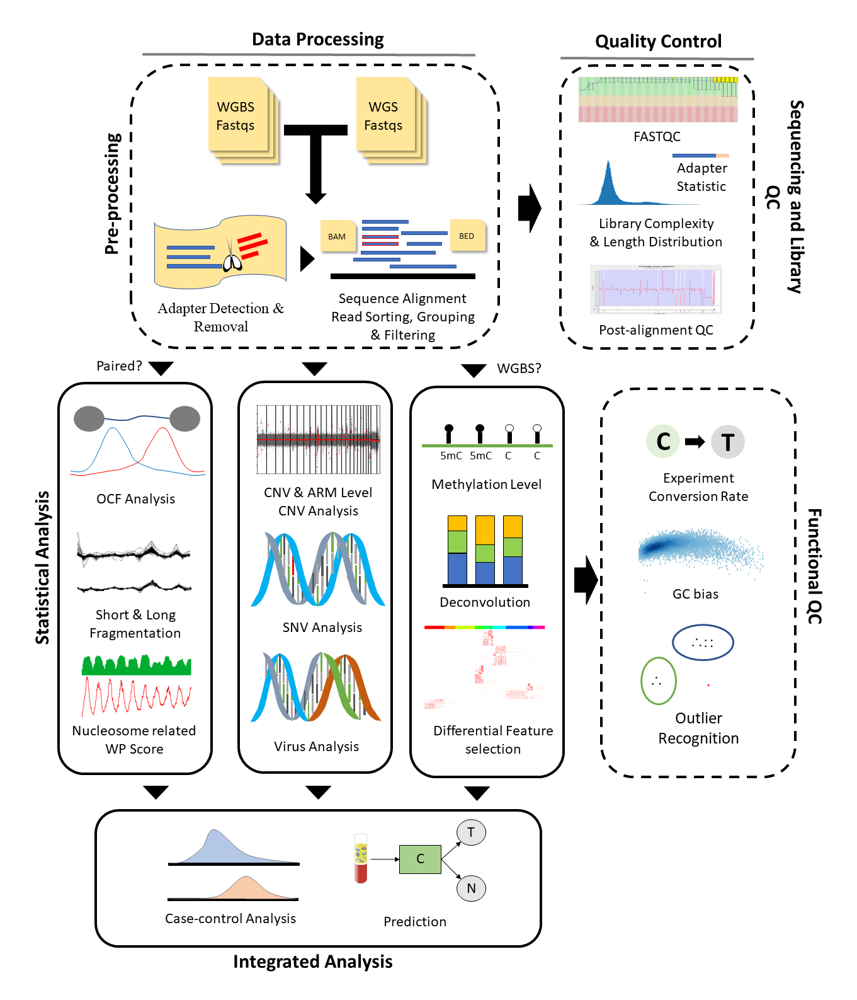

# cfDNApipe

## Introduction

&emsp;**cfDNApipe(<u>C</u>ell <u>F</u>ree <u>DNA</u> <u>Pipe</u>line)** is an integrated pipeline for analyzing [cell-free DNA](https://en.wikipedia.org/wiki/Circulating_free_DNA) WGBS/WGS data. It contains many cfDNA quality control and feature extration algorithms. Also we collected some useful cell free DNA references and provide them [here](https://honchkrow.github.io/cfDNAReferences/).

&emsp;The whole pipeline was established based on processing graph principle. Users can use the inside integrated pipeline for WGBS/WGS data as well as build their own analysis pipeline from any intermediate data like bam files. The main functions are as the following picture.



## Section 1: Installation Tutorial

### Section 1.1: System requirement

&emsp;The popular WGBS/WGS analysis softwares are released on Unix/Linux system, based on different program language, like Bowtie2 and Bismark. Therefore, it's very difficult to rewrite all the software in one language. Fortunately, [conda](https://docs.conda.io/en/latest/)/[bioconda](http://bioconda.github.io/) program collected many prevalent python mudules and bioinformatics software, so we can install all the dependencies through [conda](https://docs.conda.io/en/latest/)/[bioconda](http://bioconda.github.io/) and arrange pipelines using python.

&emsp;We recommend using conda environment and python >= 3.6. If you did not install conda before, please follow [this tutorial](https://docs.conda.io/projects/conda/en/latest/user-guide/install/) to install conda first.

&emsp;After installation, you can create a new virtual environment for cfDNA analysis. Virtual environment management means that you can install all the dependencies in this virtual environment and delete them easily by removing this virtual environment.

### Section 1.2: Create environment and Install Dependencies

&emsp;We test our pipeline using different version of software and provide an environment yml file for users. Users can download this file and create the environment in one command line. 

&emsp;first, please download the yml file.

```shell
wget https://raw.githubusercontent.com/Honchkrow/cfDNApipe/master/environment.yml
```

&emsp;Then, run the following command. The environment will be created and all the dependencies as well as the latest cfDNApipe will be installed.

```shell
conda env create -f environment.yml
```

### Section 1.3: Enter Environment and Use cfDNApipe

&emsp;Once the environment is created, user can enter environment using the foloowing command.

```shell
conda activate cfDNApipe
```

 Now, just open python and process **cell free DNA WGBS/WGS paired/single end** data.

## Section 2: A Quick Tutorial for Analysis WGBS data

&emsp;In this section, we will demonstrate how to perform a quick analysis for paired end WGBS data using the build-in pipeline.

### Section 2.1: Set Global Reference Configures

&emsp;First, user must set some important configure, for example, which genome to be used, how many threads should be used and where to put the analysis results. cfDNApipe provide a configure function for user to set these parameters. Below is an instance.

```Python
from cfDNApipe import *

pipeConfigure(
    threads=60,
    genome="hg19",
    refdir=r"./genome/hg19_bismark",
    outdir=r"./pipeline-for-paired-WGBS",
    data="WGBS",
    type="paired",
    build=True,
    JavaMem="10g",
)
```

&emsp;pipeConfigure function takes 8 necessary parameters as input. 
- **'threads'**: the max threads user want to be used. 
- **'genome'**: which genome to be used, must be 'hg19' or 'hg38'. 
- **'refdir'**: where to find genome reference files like sequence fasta file and CpG island ananotation files. 
- **'outdir'**: where to put all the output files.
- **'data'**: "WGBS" or "WGS".
- **'type'**: "paired" or "single".
- **'build'**: download and build reference or not after reference checking.
- **'JavaMem'**: maximum memory java program can used.

&emsp;Once done, the program will print "Background reference check finished!", then users can do the analyzing steps.

### Section 2.2: Perform build-in WGBS Analysis Pipeline

&emsp;cfDNApipe provides an integrated pipeline for paired/single end WGBS/WGS data, user can use it easily by assigning fastq sequencing files as the input of the pipeline. All the parameters used in pipeline are carefully selected after numerous tests.

```Python
res = cfDNAWGBS(inputFolder=r"path_to_fastqs",
                idAdapter=True,
                rmAdapter=True,
                dudup=True,
                CNV=True,
                armCNV=True,
                fragProfile=True,
                verbose=True)
```

&emsp;In the above example, user just pass the input folder which contains all the rwaw fastq files to the function, then the processing will start and all results will be saved in outdir mentioned in the former section.

&emsp;What's more, cfDNApipe also provides **case and control**  comparison analysis for WGBS/WGS data. For using this function, please see the section 4 and function **cfDNAWGS2** and **cfDNAWGBS2**.

## Section 3: cfDNApipe Highlights

&emsp;We designed many useful build-in mechanism in cfDNApipe. Here, we introduce some of them to the users. 

### Section 3.1: Output Folder Arrangement

&emsp;Generally, the cell free DNA analysis contains many steps, which will generate lots of output files. cfDNApipe arrange the outputs into different folders. The output folders are as follows.

```
pipeline-for-paired-WGBS/
├── pipeline-for-paired-WGBS/  
    ├── final_result/  
    ├── report_result/  
    │   ├── Cell_Free_DNA_WGBS_Analysis_Report.html  
    │   └── Other files and folders  
    └── intermediate_result/  
        ├── step_01_inputprocess  
        ├── step_02_fastqc  
        ├── step_02_identifyAdapter  
        └── Other processing folders  
```

&emsp;There will be 3 major ouput folder, named **"final_result"**, **"report_result"**, and **"intermediate_result"**. 
&emsp;Folder **"final_result"** is an empty folder for users to save any result for this analysis. 
&emsp;Folder **"report_result"** save a pretty html report and related data which shows some visualization results like quality control and figures. 
&emsp;Folder **"intermediate_result"** contains folders named by every single step, all the intermediate results and processing record will be save in each folder. User can accsee any files they want.

### Section 3.2: Analysis Report

&emsp;Folder **"report_result"** many visable analysis results, like DNA fragment length distribution and mapping statistics. The report folder can be copied to any where. Here is an [example]() showing the final report.
&emsp;We try our best to plot every figure ready to publish. If users want to make some changes like changing colors, they can access figure data saved at every step foler in  **"intermediate_result"**.

### Section 3.3: Reference Auto Download and Build Function

&emsp;In the section2.2, We introduced global reference configure function, in which parameter **'build'** means whether to download and build references.
&emsp;cfDNApipe contains 2 type of global reference configure function, **pipeConfigure** and **pipeConfigure2**. Function **pipeConfigure** is for single type data analysis. Function **pipeConfigure2** is for case and control analysis. Either function will check the reference files, such as bowtie2 and bismark references. If not detected, references will be downloaded and built. For example, if human genome 'hg19' is specified and there is no this reference genome file in refdir, then hg19.fa will be downloaded from UCSC and other annotation files will be downloaded from [cfDNAReferences](https://honchkrow.github.io/cfDNAReferences/). 
&emsp;This step is **necessary** but put things right once and for all. If user already build references for Bismark (a folder contains Bisulfite_Genome and hg19.fa), then just set this folder as refdir, the program will **skip** download hg19.fa and rebuild Bismark reference. cfDNApipe will only download other references and this will save lots of times.

### Section 3.4: Breakpoint Detection

Sometimes, the program may be interrupted by irresistible reasons like computer crash. cfDNApipe provide **breakpoint detection mechanism**, which compute md5 code for inputs, outputs, as well as all parameters. Therefore, user do not warry about any interrupt situation. Re-running the same program, the finished step will show finished message like below.

```shell
************************************************************
                bowtie2 has been completed!
************************************************************
```

### Section 3.5: Other Mechanisms
- Parallel Computing
- Memory Control
- Dataflow Graph
- Case and Control Analysis
- Numerous QC functions
- Inputs Legality Checking
- ......

## Section 4: Perform Case-Control Analysis for WGBS data

&emsp;The analysis steps for case-control analysis are the same as section 2.1 and 2.2. First, set global configure. Second, run analysis command.

&emsp;Setting global configure is a little bit different from section 2.1. Below is an example.

```Python
from cfDNApipe import *

pipeConfigure2(
    threads=20,
    genome="hg19",
    refdir=r"./genome/hg19_bismark",
    outdir=r"./pipeline-for-paired-WGBS",
    data="WGBS",
    type="paired",
    JavaMem="8G",
    case="cancer",
    ctrl="normal",
    build=True,
)
```

&emsp;Here, 2 more parameters are used. Parameter **"case"** and **"ctrl"** is the name flag for case and control data. These two parameters control the output for case and control samples. The output folder will become like below.

```
pipeline-for-paired-WGBS/
├── pipeline-for-paired-WGBS/
    ├── cancer
    |   ├── final_result/  
    |   ├── report_result/
    |   └── intermediate_result/
    └── normal
        ├── final_result/  
        ├── report_result/
        └── intermediate_result/
```

&emsp;Next, using function **cfDNAWGBS2** to processing case and control analysis.

```Python
case, ctrl, comp = cfDNAWGBS2(
    caseFolder=r"case_fastqs",
    ctrlFolder=r"ctrl_fastqs",
    caseName="cancer",
    ctrlName="tumor",
    idAdapter=True,
    rmAdapter=True,
    dudup=True,
    armCNV=True,
    CNV=True,
    fragProfile=True,
    verbose=False,
)
```

&emsp;After analysis, user can get all the output as well as reports for case and control. Of course, the comparison results will be saved in **case folder**.


## Section 5: How to Build Customized Pipepline using cfDNApipe

&emsp;Some users are familiar with cfDNA processing and want to customize their own pipelines. cfDNApipe provide a flexible pipeline framework for building customized pipeline. The following is an example of how to build pipeline from intermediate steps.

&emsp;Assume that we hasve same WGS samples and all the samples have already been aligned. Now, we want to perform CNA analysis to these data compared with default sequence and get gene level annotation.


&emsp;First, set global configure.

```Python
from cfDNApipe import *
import glob

pipeConfigure(
    threads=20,
    genome="hg19",
    refdir=r"./genome/hg19_bowtie2",
    outdir=r"/pipeline-for-paired-WGS",
    data="WGS",
    type="paired",
    JavaMem="10G",
    build=True,
)
```

&emsp;Second, take all the aligned bam as inputs.

```Python
# get all bam files
bams = glob.glob("samples/*.bam")

# sort bam and remove duplicates
res_bamsort = bamsort(bamInput=bams, upstream=True)
res_rmduplicate = rmduplicate(upstream=res_bamsort)

# perform CNV analysis
res_cnvbatch = cnvbatch(
    caseupstream=res_rmduplicate,
    access=Configure.getConfig("access-5kb-mappable"),
    annotate=Configure.getConfig("refFlat"),
    stepNum="CNV01",
)
res_cnvPlot = cnvPlot(upstream=res_cnvbatch, stepNum="CNV02")
res_cnvTable = cnvTable(upstream=res_cnvbatch, stepNum="CNV03")
res_cnvHeatmap = cnvHeatmap(upstream=res_cnvbatch, stepNum="CNV04")
```

&emsp;In the above codes, **"upstream=True"** means puts all the results to the output folder mentioned in section 3.1. CNV analysis needs two reference files is control samples are not provided. These two reference files are already included in cfDNApipe reference data, user can access them easily.
&emsp;Once finished, user can get CNV related files like below.

