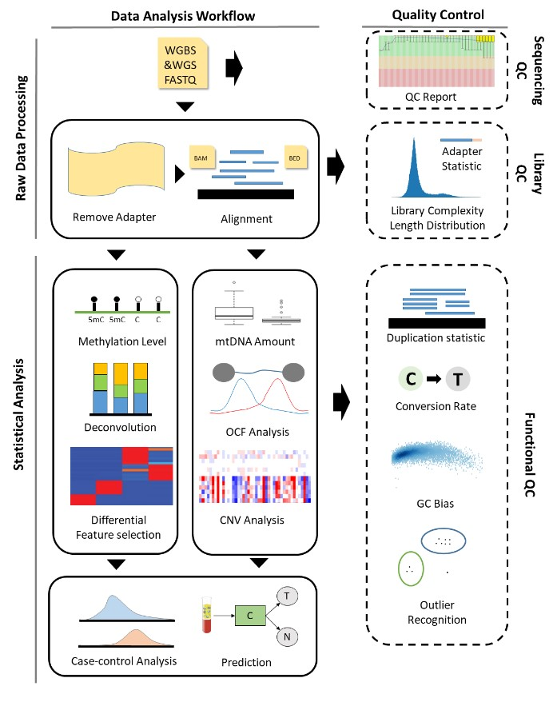

# cfDNApipe

[](https://travis-ci.org/pages-themes/minimal) [](https://badge.fury.io/rb/jekyll-theme-minimal)

[cfDNApipe](https://en.wikipedia.org/wiki/Circulating_free_DNA)(<u>C</u>ell <u>F</u>ree <u>DNA</u> <u>Pipe</u>line) is an integrated pipeline for analyzing cell-free DNA WGBS/WGS data. It contains many cfDNA quality control and feature extration algorithms. 

The whole pipeline was established based on processing graph principle. Users can use the inside integrated pipeline for WGBS/WGS data as well as build their own analysis pipeline from any intermediate data like bam files. The main functions are as the following picture.



## Section 1: Installation Tutorial

### Section 1.1: System requirement
Unix/Linux system, conda environment and python >= 3.6

you can create a new virtual environment using the following command, it will not influence your default invironment and be removed easily:

```shell
# create a conda environment named cfDNApipe and install python3.6
conda create -n cfDNApipe python=3.6
# enetr the environment
conda activate cfDNApipe
```

### Section 1.2: Install Dependencies
Please download this repository and put it in your working directory.

```shell
git clone https://github.com/Honchkrow/cfDNApipe.git
```

Then, run the following command and following the instrucion to install the dependencies.

```shell
cd cfDNApipe
chmod +x sysCheck
./sysCheck
```

If your computer fulfills the requirement, you will see the following message.

```shell
The environment configuration is done!
```

### Section 1.3: Install cfDNAipe
Install cfDNApipe module.

```shell
pip install ./dist/cfDNApipe-0.0.4.tar.gz
```
