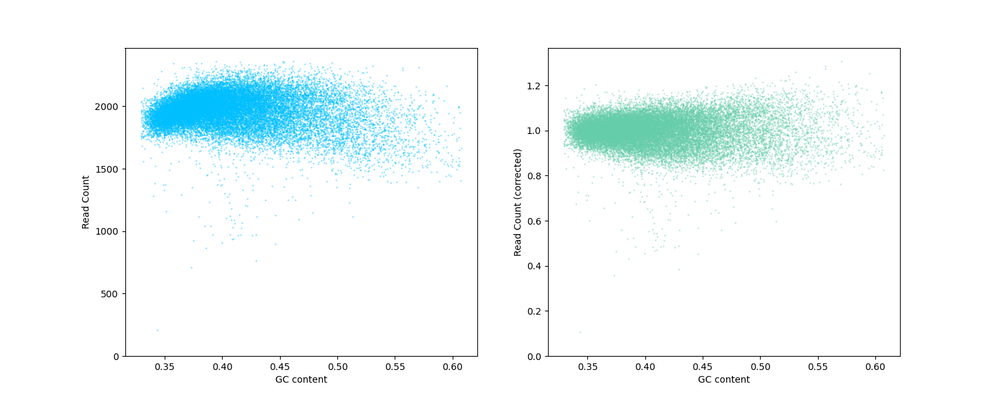
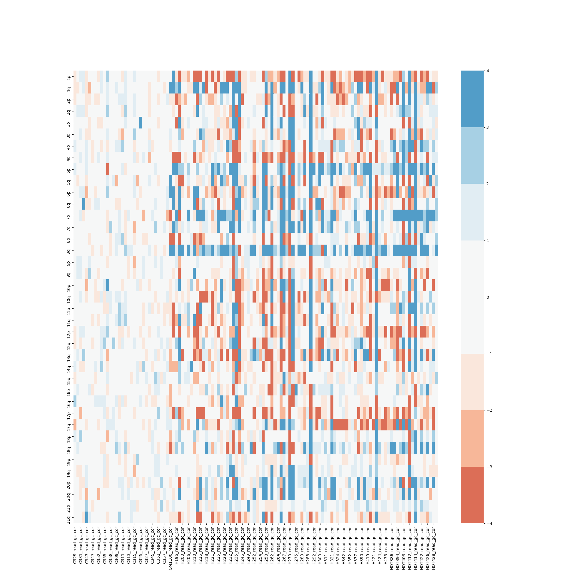
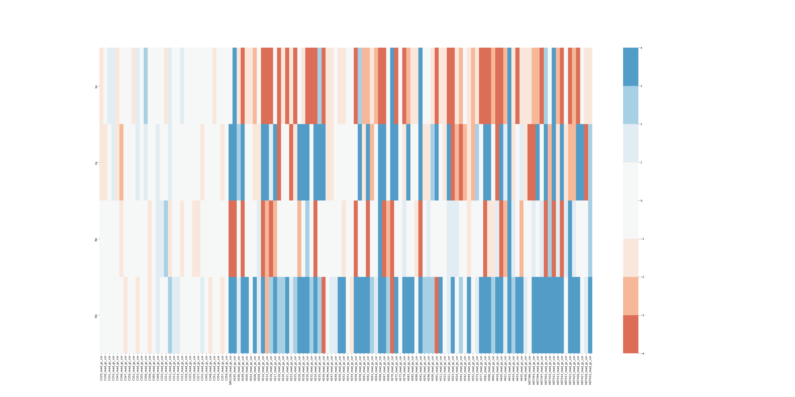
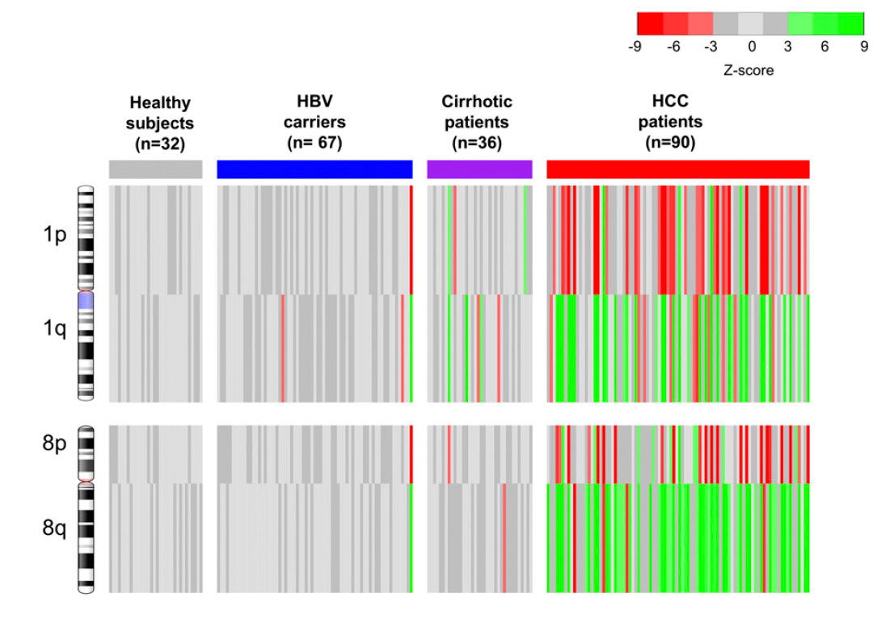
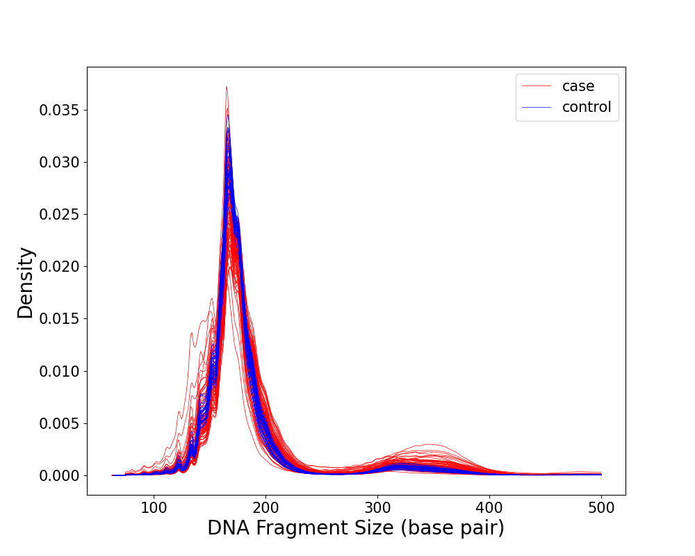
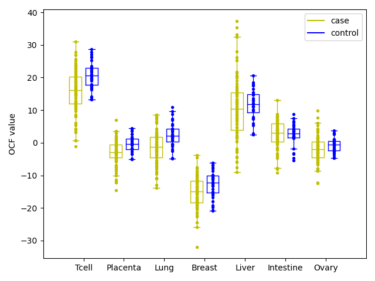
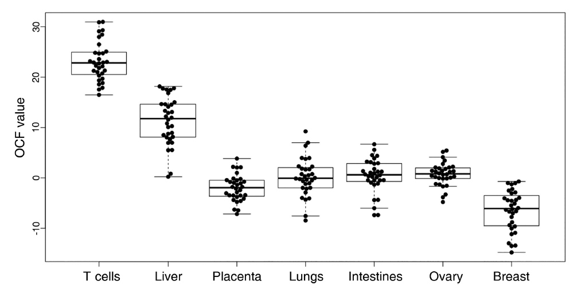
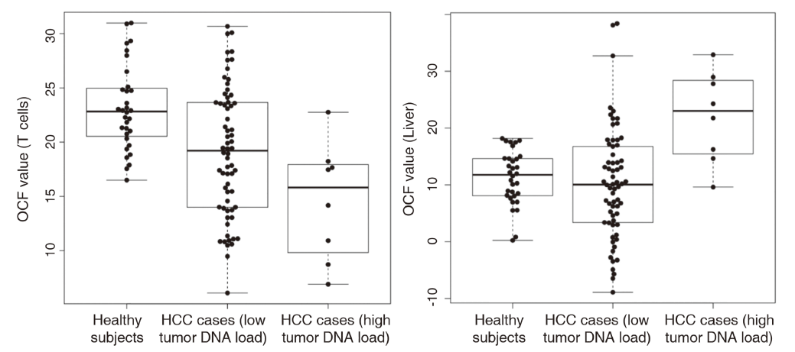
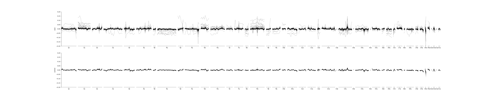

<center>
<font size=72>Supplementary Material</font>
</center>

<br />
<br />

   * [1 Introduction](#1-introduction)
   * [2 Package Installation and Loading](#2-package-installation-and-loading)
      * [2.1 Download and Installation](#21-download-and-installation)
      * [2.2  Create Environment and Install Dependencies](#22--create-environment-and-install-dependencies)
      * [2.3 Enter Environment and Use cfDNApipe](#23-enter-environment-and-use-cfdnapipe)
   * [3 Functional Summary](#3-functional-summary)
      * [3.1 Raw Data Processing and Quality Control](#31-raw-data-processing-and-quality-control)
      * [3.2 Statistical Analysis](#32-statistical-analysis)
   * [4 Quick Start for Preset Pipeline](#4-quick-start-for-preset-pipeline)
      * [4.1 Single Group Analysis](#41-single-group-analysis)
      * [4.2 Case Control Analysis](#42-case-control-analysis)
   * [5 Customized Pipeline For Pipeline Function Verification](#5-customized-pipeline-for-pipeline-function-verification)
      * [5.1 Large-Scale CNV in HCC patient](#51-large-scale-cnv-in-hcc-patient)
      * [5.2 Fragment Length Analysis of cfDNA](#52-fragment-length-analysis-of-cfdna)
      * [5.3 Orientation-Aware cfDNA Fragmentation Analysis](#53-orientation-aware-cfdna-fragmentation-analysis)
      * [5.4 Enhenced Fragmentation Analysis Reveals Disorder of cfDNA](#54-enhenced-fragmentation-analysis-reveals-disorder-of-cfdna)


# 1 Introduction
&emsp;**cfDNApipe(<u>C</u>ell <u>F</u>ree <u>DNA</u> <u>Pipe</u>line)** is an integrated pipeline for analyzing [cell-free DNA](https://en.wikipedia.org/wiki/Circulating_free_DNA) WGBS/WGS data. It contains many cfDNA quality control and feature extration algorithms. Also we collected some useful cell free DNA references and provide them [here](https://honchkrow.github.io/cfDNAReferences/).

&emsp;The whole pipeline was established based on flow graph principle. Users can use the integrated pipeline for WGBS/WGS data as well as build their own analysis pipeline from any intermediate data like bam files. The main functions are as the following picture.

<center>
    
    <br>
    <div style="color:orange; border-bottom: 1px solid #d9d9d9;
    display: inline-block;
    color: #999;
    padding: 2px;">cfDNApipe Functions</div>
</center>

<br />
<br />

# 2 Package Installation and Loading

<br />

## 2.1 Download and Installation
&emsp;The popular WGBS/WGS analysis software are released on Unix/Linux system, based on different program language, like Bowtie2 and Bismark. Therefore, it's very difficult to rewrite all the software in one language. Fortunately, [conda](https://docs.conda.io/en/latest/)/[bioconda](http://bioconda.github.io/) program collected many prevalent bioinformatics related python mudules and software, so we can install all the dependencies through [conda](https://docs.conda.io/en/latest/)/[bioconda](http://bioconda.github.io/).If you did not install conda before, please follow [this tutorial](https://docs.conda.io/projects/conda/en/latest/user-guide/install/) to install conda first.

&emsp;After installation, you can create a new virtual environment for cfDNA analysis. Virtual environment management means that you can install all the dependencies in this virtual environment and delete them easily by removing this virtual environment.

<br />

## 2.2  Create Environment and Install Dependencies

&emsp;We tested our pipeline using different version of software and provide an environment yml file for users. Users can download this file and create the environment in one command line without any software conflict. 

&emsp;first, please download the yml file.

``` shell
wget https://raw.githubusercontent.com/Honchkrow/cfDNApipe/master/environment.yml
```

&emsp;Then, run the following command to create an virtual environment named cfDNApipe. The environment will be created and all the dependencies as well as the latest cfDNApipe will be installed.

``` shell
conda env create -n cfDNApipe -f environment.yml
```

<font color=red>Note:</font> The environment name can be changed by replacing "-n cfDNApipe" to "-n environment_name".

<br />

## 2.3 Enter Environment and Use cfDNApipe

&emsp;Once the environment is created, user can enter environment using the foloowing command.

``` shell
conda activate cfDNApipe
```

&emsp;Now, just open python and process **cell free DNA WGBS/WGS paired/single end** data.

<br />
<br />

# 3 Functional Summary

&emsp;The whole workflow for cfDNApipe can be divided into two parts, raw data processing and statistical analysis.

<br />

## 3.1 Raw Data Processing and Quality Control
&emsp;In this part, cfDNApipe offers functions to process raw sequencing data saved in fastq format to aligned bam or bed files. It wraps FASTQC for pre-alignment raw sequencing data quality control. AdapterRemoval is used for adapter detection and removal. Bowtie2 and Bismark are adopted for read alignment and BAM format output will be generated. In addition, cfDNApipe calls different duplication removal tools for WGS and WGBS data. The bam format output can be converted to BED format if needed. Post-alignment quality control will be executed by Qualimap, which reports basic information and statistics for the alignment data such as genome coverage and GC content. What's more, cfDNApipe can sort, index, group the aligned read for the downstream statistical analysis.

<br />

## 3.2 Statistical Analysis
&emsp;In this part, cfDNApipe provides multiple state-of-the-art statistical analysis modules for cfDNA data. Methylation level can be culculated for any given genome regions and  methylation signal will be deconvoluted to reveal the conponent changes in cfDNA. Large-scale CNV (arm-level) and small-scale CNV (bin-level) are culculated to reveal genomic gains and losses. cfDNA fragmentation analysis aims to demonstrate alters of DNA fragment length and disorder of fragmentation pattern. Orientation-aware
cfDNA fragmentation (OCF) analysis measures the differential phasing of upstream and downstream fragment ends in tissue-specific open chromatin regions. Besides, some functions are sepcific to cfDNA WGS data. Virus related to some specific diseases like HBV can be detected. Somatic and germline mutations is identified by comparing the sequence of DNA with that in control samples or default reference.

<br />


# 4 Quick Start for Preset Pipeline

&emsp;cfDNApipe provides easy-to-use and friendly preset pipeline for cfDNA WGS/WGBS data. Users only need to provide the input raw sequencing files (FASTQ format), genome reference and output folder, then the program will do everything automatically. When the analysis finished, an pretty HTML report will be generated for demonstrating quality control and statistical analysis results. Here, we provide 2 examples for **single group analysis** and **case-control analysis**.

<br />

## 4.1 Single Group Analysis

&emsp;Here, we show a single group analysis procedure for single end WGBS  data. A runnable small dataset can be download from [***](). All the samples should be put in a folder without any other files. 

&emsp;First load cfDNApipe and set global reference parameters for pipeline.

```Python
from cfDNApipe import *

pipeConfigure(
    threads=60,
    genome="hg19",
    refdir=r"reference_genome/hg19",
    outdir=r"output/single_WGBS",
    data="WGBS",
    type="single",
    build=True,
    JavaMem="10g",
)
```

&emsp;Second, run the processing pipeline.

```Python
res = cfDNAWGBS(
    inputFolder=r"path_to_WGBS_SE",
    idAdapter=True,
    rmAdapter=True,
    rmAdOP={"--gzip": True},
    dudup=True,
    CNV=True,
    armCNV=True,
    fragProfile=True,
    verbose=True,
)
```

&emsp;Now, you can wait for finish running.

&emsp;The real dataset is from paper "[Plasma DNA tissue mapping by genome-wide methylation sequencing for noninvasive prenatal, cancer, and transplantation assessments](https://www.pnas.org/content/112/40/E5503)" with accession number [EGAS00001001219](https://www.ebi.ac.uk/ega/studies/EGAS00001001219) is processed. We only use Hepatocellular Carcinoma (HCC) patients data for demonstration. The final report can be downloaded from [here](***).

## 4.2 Case Control Analysis

&emsp;Here, we show a case controlanalysis procedure for paired end WGS data. A runnable small dataset can be download from [***](). Each group samples should be put in each folder without any other files. 

&emsp;First load cfDNApipe and set global reference parameters for pipeline.

```Python
from cfDNApipe import *

pipeConfigure2(
    threads=60,
    genome="hg19",
    refdir="reference_genome/hg19",
    outdir="output/paired_WGS",
    data="WGS",
    type="paired",
    JavaMem="8G",
    case="cancer",
    ctrl="normal",
    build=True,
)
```

&emsp;Second, run the processing pipeline.

```Python
a, b = cfDNAWGS2(
    caseFolder="path_to_data/case",
    ctrlFolder="path_to_data/ctrl",
    caseName="case",
    ctrlName="ctrl",
    idAdapter=True,
    rmAdapter=True,
    rmAdOP={"--gzip": True},
    bowtie2OP={"-q": True, "-N": 1, "--time": True},
    dudup=True,
    CNV=True,
    armCNV=True,
    fragProfile=True,
    OCF=True,
    report=True,
    verbose=False,
)
```

&emsp;Now, you can wait for finish running.

&emsp;The real dataset is from paper "[Lengthening and shortening of plasma DNA in hepatocellular carcinoma patients](https://www.pnas.org/content/112/11/E1317)" with accession number [EGAS00001001024](https://www.ebi.ac.uk/ega/studies/EGAS00001001024) is processed. We use Hepatocellular Carcinoma (HCC) patients and the healthy data for demonstration. The final report can be downloaded from [here](***).

<br />

# 5 Customized Pipeline For Pipeline Function Verification

&emsp;cfDNApipe integrates several state-of-the-art statistical models. Here, we illustrate how to use customized pipeline in cfDNApipe to perform these analysis. 

&emsp;The analyses performed below are start with bam or bed files. Some of them reproduce the results of the published papers.

## 5.1 Large-Scale CNV in HCC patient

&emsp;CNV is a common phenomenon appears in kinds of cancer types. CNV is also detected from cfDNA WGS data reported by [Jiang, et al](...). However, due to the different ctDNA cncentration, the aggregated signal in arm-level reveals more significant copy number changes. 

&emsp;Here, using the dataset from [Jiang, et al](...), we will perform the Large-scale (arm-level) CNV to reveal the difference between HCC patients and the healthy.

&emsp;First, set global parameters and get the aligned read files.

```Python
from cfDNApipe import *
import glob

pipeConfigure2(
    threads=20,
    genome="hg19",
    refdir=r"reference_genome/hg19",
    outdir=r"output/pcs_armCNV",
    data="WGS",
    type="paired",
    JavaMem="8G",
    case="cancer",
    ctrl="normal",
    build=True,
)

verbose = False

case_bam = glob.glob("path_to_data/HCC/*.bam")
ctrl_bam = glob.glob("path_to_data/CTR/*.bam")
```

&emsp;Code above will generate the output folders for case  and control based on the flag set in function "pipeConfigure2". The output folders are as below.

```
pcs_armCNV/
├──cancer/
│   ├── final_result/  
│   ├── report_result/  
│   └── intermediate_result/ 
└──normal/
    ├── final_result/  
    ├── report_result/  
    └── intermediate_result/ 
```

&emsp;Second, compute GC corrected signal for case and control sample.

```Python
# count case
switchConfigure("cancer")
case_bamCounter = bamCounter(
    bamInput=case_bam, upstream=True, verbose=verbose, stepNum="case01"
)
case_gcCounter = runCounter(
    filetype=0, upstream=True, verbose=verbose, stepNum="case02"
)
case_GCCorrect = GCCorrect(
    readupstream=case_bamCounter,
    gcupstream=case_gcCounter,
    verbose=verbose,
    stepNum="case03",
)

# count ctrl
switchConfigure("normal")
ctrl_bamCounter = bamCounter(
    bamInput=ctrl_bam, upstream=True, verbose=verbose, stepNum="ctrl01"
)
ctrl_gcCounter = runCounter(
    filetype=0, upstream=True, verbose=verbose, stepNum="ctrl02"
)
ctrl_GCCorrect = GCCorrect(
    readupstream=ctrl_bamCounter,
    gcupstream=ctrl_gcCounter,
    verbose=verbose,
    stepNum="ctrl03",
)
```

&emsp;After this step, users can find the outputs in each step folder like blew. 

```
pcs_armCNV/
├──cancer/
│   ├── final_result/  
│   ├── report_result/  
│   └── intermediate_result/  
│       ├── step_case01_bamCounter  
│       ├── step_case02_runCounter  
│       └── step_case03_GCCorrect  
├──normal/
    ├── final_result/  
    ├── report_result/  
    └── intermediate_result/  
        ├── step_ctrl01_bamCounter  
        ├── step_ctrl02_runCounter  
        └── step_ctrl03_GCCorrect 
```

&emsp;Users can also check the GC corrected results in folder with suffix "GCCorrect". HCC patient sample "H228" results is shown here.

<center>
    
    <br>
    <div style="color:orange; border-bottom: 1px solid #d9d9d9;
    display: inline-block;
    color: #999;
    padding: 2px;">GC content correction for sample H228</div>
</center>

<br />

&emsp;Finally, compute Z-score for CNV signal and generate overall illustration for autosome.

```Python
switchConfigure("cancer")
res_computeCNV = computeCNV(
    caseupstream=case_GCCorrect,
    ctrlupstream=ctrl_GCCorrect,
    stepNum="ARMCNV",
    verbose=verbose,
)
```

&emsp;Users can find the final Z-score file and the figure for losses and gains like below.

<center>
    
    <br>
    <div style="color:orange; border-bottom: 1px solid #d9d9d9;
    display: inline-block;
    color: #999;
    padding: 2px;">CNV Z-score for all samples</div>
</center>

<br />

&emsp;For HCC patients, the forper work has reported that p,q arm in chromatin 1 and 8 shows significant gain and loss. Ploting p,q arm in chromatin 1 and 8 in a new figure, we can see the similar results as the [paper](...).

<center>
    
    <br>
    <div style="color:orange; border-bottom: 1px solid #d9d9d9;
    display: inline-block;
    color: #999;
    padding: 2px;">CNV Z-score in chromatin 1 and 8 for all samples</div>
</center>

<br />

<center>
    
    <br>
    <div style="color:orange; border-bottom: 1px solid #d9d9d9;
    display: inline-block;
    color: #999;
    padding: 2px;">CNV Z-score in chromatin 1 and 8 for all samples from paper</div>
</center>

<br />


## 5.2 Fragment Length Analysis of cfDNA  

&emsp;The size distribution of cfDNA fragments shows some intrinsic nature in the formation of cfDNA. For example, periodicities corresponding to nucleosomes (~147 bp) and chromatosomes (nucleosome + linker histone; ~167 bp) have been noticed. What's more, circulating tumor DNA exists in plasma of patient with cancer. Lots of studies has shown that plasma DNA molecules released by tumors is shorter than that released by normal tissue. cfDNApipe takes this information as an important signiture of plasma DNA and can generate distribution plot for every samples as well as comparison for different groups.

&emsp;Here, we shows how to generate length distribution for case control samples and compare the difference.

&emsp;First, set global parameters and get the aligned read files in bed format.

```Python
from cfDNApipe import *
import glob

pipeConfigure(
    threads=20,
    genome="hg19",
    refdir=r"/home/wzhang/genome/hg19",
    outdir=r"/data/wzhang/pcs_final/pcs_fraglen",
    data="WGS",
    type="paired",
    JavaMem="10G",
    build=True,
)

verbose = False

case_bed = glob.glob("/data/wzhang/pcs_final/HCC/*.bed")
ctrl_bed = glob.glob("/data/wzhang/pcs_final/Healthy/*.bed")
```

&emsp;Second, using the following one command to generate plotings for every sample and compare the proportions of fragments below 150bp between HCC patients (case) and the healthy (control).

```Python
res_fraglenplot_comp = fraglenplot_comp(
    casebedInput=case_bed, ctrlbedInput=ctrl_bed, caseupstream=True, verbose=verbose)
```

&emsp;Users can find figures for every sample (figures not show) and comparison results like below.

<center>
    
    <br>
    <div style="color:orange; border-bottom: 1px solid #d9d9d9;
    display: inline-block;
    color: #999;
    padding: 2px;">cfDNA fragment size distribution between HCC patients (case) and the healthy (control)</div>
</center>

<br />


## 5.3 Orientation-Aware cfDNA Fragmentation Analysis

&emsp;Cancerous cells and normal tissue cell shows different chromatin accessibility therefore these differnet cells release cfDNA from different genome location. Digested by enzyme, cfDNA from different tissue shows different chromatin accessibility related signal. Orientation-aware cfDNA fragmentation (OCF) analysis is to quantify this signal and reveal the origin of cfDNA.

&emsp;Here, we shows how to perform OCF analysis for case control samples and compare the difference.

&emsp;First, set global parameters and get the aligned read files in bed format.

```Python
from cfDNApipe import *
import glob

pipeConfigure2(
    threads=20,
    genome="hg19",
    refdir=r"/home/wzhang/genome/hg19",
    outdir=r"/data/wzhang/pcs_final/pcs_ocf",
    data="WGS",
    type="paired",
    JavaMem="8G",
    case="cancer",
    ctrl="normal",
    build=True,
)

verbose = False

case_bed = glob.glob("/data/wzhang/pcs_final/HCC/*.bed")
ctrl_bed = glob.glob("/data/wzhang/pcs_final/Healthy/*.bed")
```

&emsp;Second, using the following commands to calculate OCF value (the tissue related data is provided by cfDNApipe) and compare OCF value between HCC patients (case) and the healthy (control).

```Python
# case
switchConfigure("cancer")

res_computeOCF = computeOCF(
    casebedInput=case_bed,
    ctrlbedInput=ctrl_bed,
    caseupstream=True,
    verbose=verbose,
)
res_OCFplot = OCFplot(upstream=res_computeOCF, verbose=verbose)
```

&emsp;Users can find comparison figure for HCC patients (case) and the healthy (control). The figure from paper is also shown below.

<center>
    
    <br>
    <div style="color:orange; border-bottom: 1px solid #d9d9d9;
    display: inline-block;
    color: #999;
    padding: 2px;">OCF analysis between HCC patients (case) and the healthy (control)</div>
</center>

<br />

<center>
    
    <br>
    <div style="color:orange; border-bottom: 1px solid #d9d9d9;
    display: inline-block;
    color: #999;
    padding: 2px;">OCF analysis for healthy people from paper</div>
</center>

<br />

<center>
    
    <br>
    <div style="color:orange; border-bottom: 1px solid #d9d9d9;
    display: inline-block;
    color: #999;
    padding: 2px;">OCF comparison of T cell and Liver between HCC patients (case) and the healthy (control)</div>
</center>

<br />


## 5.4 Enhenced Fragmentation Analysis Reveals Disorder of cfDNA

&emsp;The former work has announced disorder in arm-level CNV, and Florent, et al. reported another disorder in various cancer groups. Next, we shows how to perform the enhenced fragmentation analysis for case control samples and compare the difference.

&emsp;First, set global parameters and get the aligned read files in bed.gz format.

```Python
from cfDNApipe import *
import glob

pipeConfigure2(
    threads=20,
    genome="hg19",
    refdir=r"/home/wzhang/genome/hg19",
    outdir=r"/data/wzhang/pcs_final/pcs_fp",
    data="WGS",
    type="paired",
    JavaMem="8G",
    case="cancer",
    ctrl="normal",
    build=True,
)

verbose = False

case_bedgz = glob.glob("/data/wzhang/pcs_final/HCC/*.bed.gz")
ctrl_bedgz = glob.glob("/data/wzhang/pcs_final/Healthy/*.bed.gz")
```

&emsp;Second, using the following commands to remove GC-bias and calculate enhenced fragmentation profiles between HCC patients (case) and the healthy (control).

```Python

# case
switchConfigure("cancer")
case_fragCounter = fpCounter(
    bedgzInput=case_bedgz, upstream=True, verbose=verbose, stepNum="case01", processtype=1
)
case_gcCounter = runCounter(
    filetype=0, binlen=5000000, upstream=True, verbose=verbose, stepNum="case02"
)
case_GCCorrect = GCCorrect(
    readupstream=case_fragCounter,
    gcupstream=case_gcCounter,
    readtype=2,
    corrkey="-",
    verbose=verbose,
    stepNum="case03",
)

# ctrl
switchConfigure("normal")
ctrl_fragCounter = fpCounter(
    bedgzInput=ctrl_bedgz, upstream=True, verbose=verbose, stepNum="ctrl01", processtype=1
)
ctrl_gcCounter = runCounter(
    filetype=0, binlen=5000000, upstream=True, verbose=verbose, stepNum="ctrl02"
)
ctrl_GCCorrect = GCCorrect(
    readupstream=ctrl_fragCounter,
    gcupstream=ctrl_gcCounter,
    readtype=2,
    corrkey="-",
    verbose=verbose,
    stepNum="ctrl03",
)

switchConfigure("cancer")
res_fragprofplot = fragprofplot(
    caseupstream=case_GCCorrect,
    ctrlupstream=ctrl_GCCorrect,
    stepNum="FP",
)
```

&emsp;The results below shows a disorder fragmentation profile of HCC patient compared with the healthy group.

<center>
    
    <br>
    <div style="color:orange; border-bottom: 1px solid #d9d9d9;
    display: inline-block;
    color: #999;
    padding: 2px;">Fragmentation Profile Between HCC patients (case) and the healthy (control)</div>
</center>

<br />


