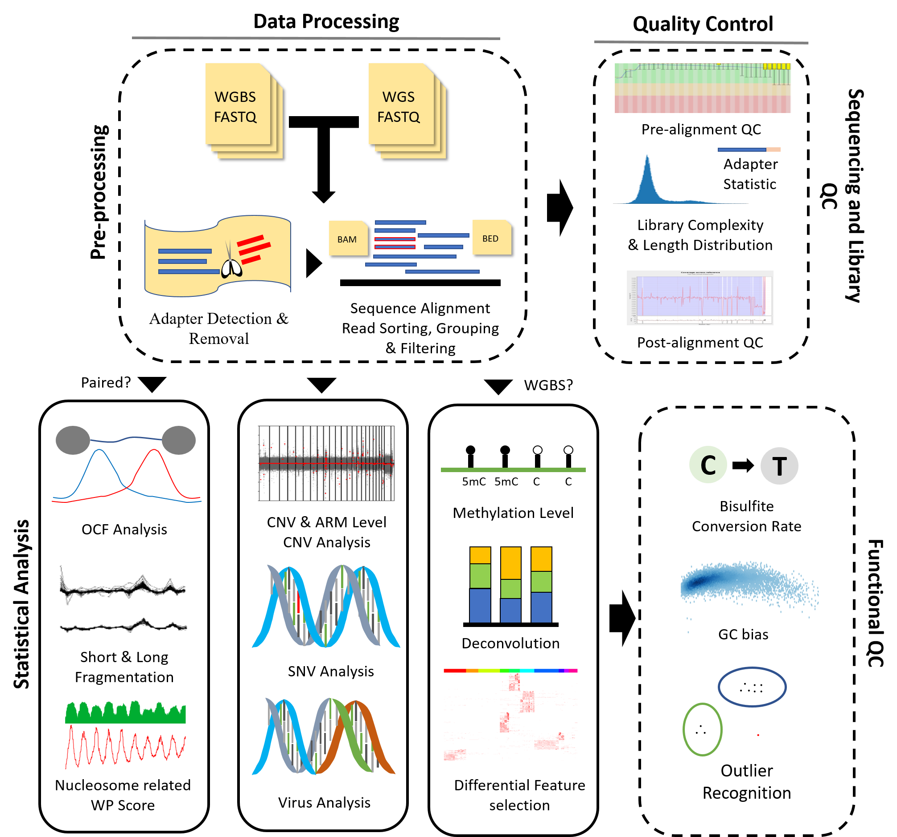

<center>
<font size=72>Supplementary Material</font>
</center>

<br />
<br />

# 1 Introduction
&emsp;**cfDNApipe(<u>C</u>ell <u>F</u>ree <u>DNA</u> <u>Pipe</u>line)** is an integrated pipeline for analyzing [cell-free DNA](https://en.wikipedia.org/wiki/Circulating_free_DNA) WGBS/WGS data. It contains many cfDNA quality control and feature extration algorithms. Also we collected some useful cell free DNA references and provide them [here](https://honchkrow.github.io/cfDNAReferences/).

&emsp;The whole pipeline was established based on flow graph principle. Users can use the integrated pipeline for WGBS/WGS data as well as build their own analysis pipeline from any intermediate data like bam files. The main functions are as the following picture.



<br />
<br />

# 2 Package Installation and Loading

<br />

## 2.1 Download and Installation
&emsp;The popular WGBS/WGS analysis software are released on Unix/Linux system, based on different program language, like Bowtie2 and Bismark. Therefore, it's very difficult to rewrite all the software in one language. Fortunately, [conda](https://docs.conda.io/en/latest/)/[bioconda](http://bioconda.github.io/) program collected many prevalent bioinformatics related python mudules and software, so we can install all the dependencies through [conda](https://docs.conda.io/en/latest/)/[bioconda](http://bioconda.github.io/).If you did not install conda before, please follow [this tutorial](https://docs.conda.io/projects/conda/en/latest/user-guide/install/) to install conda first.

&emsp;After installation, you can create a new virtual environment for cfDNA analysis. Virtual environment management means that you can install all the dependencies in this virtual environment and delete them easily by removing this virtual environment.

<br />

## 2.2  Create Environment and Install Dependencies

&emsp;We tested our pipeline using different version of software and provide an environment yml file for users. Users can download this file and create the environment in one command line without any software conflict. 

&emsp;first, please download the yml file.

``` shell
wget https://raw.githubusercontent.com/Honchkrow/cfDNApipe/master/environment.yml
```

&emsp;Then, run the following command to create an virtual environment named cfDNApipe. The environment will be created and all the dependencies as well as the latest cfDNApipe will be installed.

``` shell
conda env create -n cfDNApipe -f environment.yml
```

<font color=red>Note:</font> The environment name can be changed by replacing "-n cfDNApipe" to "-n environment_name".

<br />

## 2.3 Enter Environment and Use cfDNApipe

&emsp;Once the environment is created, user can enter environment using the foloowing command.

``` shell
conda activate cfDNApipe
```

&emsp;Now, just open python and process **cell free DNA WGBS/WGS paired/single end** data.

<br />
<br />

# 3 Functional Summary

&emsp;The whole workflow for cfDNApipe can be divided into two parts, raw data processing and statistical analysis.

<br />

## 3.1 Raw Data Processing and Quality Control
&emsp;In this part, cfDNApipe offers functions to process raw sequencing data saved in fastq format to aligned bam or bed files. It wraps FASTQC for pre-alignment raw sequencing data quality control. AdapterRemoval is used for adapter detection and removal. Bowtie2 and Bismark are adopted for read alignment and BAM format output will be generated. In addition, cfDNApipe calls different duplication removal tools for WGS and WGBS data. The bam format output can be converted to BED format if needed. Post-alignment quality control will be executed by Qualimap, which reports basic information and statistics for the alignment data such as genome coverage and GC content. What's more, cfDNApipe can sort, index, group the aligned read for the downstream statistical analysis.

<br />

## 3.2 Statistical Analysis
&emsp;In this part, cfDNApipe provides multiple state-of-the-art statistical analysis modules for cfDNA data. Methylation level can be culculated for any given genome regions and  methylation signal will be deconvoluted to reveal the conponent changes in cfDNA. Large-scale CNV (arm-level) and small-scale CNV (bin-level) are culculated to reveal genomic gains and losses. cfDNA fragmentation analysis aims to demonstrate alters of DNA fragment length and disorder of fragmentation pattern. Orientation-aware
cfDNA fragmentation (OCF) analysis measures the differential phasing of upstream and downstream fragment ends in tissue-specific open chromatin regions. Besides, some functions are sepcific to cfDNA WGS data. Virus related to some specific diseases like HBV can be detected. Somatic and germline mutations is identified by comparing the sequence of DNA with that in control samples or default reference.

<br />


# 4 Quick Start for Preset Pipeline

&emsp;cfDNApipe provides easy-to-use and friendly preset pipeline for cfDNA WGS/WGBS data. Users only need to provide the input raw sequencing files (FASTQ format), genome reference and output folder, then the program will do everything automatically. When the analysis finished, an pretty HTML report will be generated for demonstrating quality control and statistical analysis results. Here, we provide 2 examples for **single group analysis** and **case-control analysis**.

<br />

## 4.1 Single Group Analysis

&emsp;Here, we show a single group analysis procedure for single end WGBS  data. A runnable small dataset can be download from [***](). All the samples should be put in a folder without any other files. 

&emsp;First load cfDNApipe and set global reference parameters for pipeline.

```Python
from cfDNApipe import *

pipeConfigure(
    threads=60,
    genome="hg19",
    refdir=r"reference_genome/hg19",
    outdir=r"output/single_WGBS",
    data="WGBS",
    type="single",
    build=True,
    JavaMem="10g",
)
```

&emsp;Second, run the processing pipeline.

```Python
res = cfDNAWGBS(
    inputFolder=r"path_to_WGBS_SE",
    idAdapter=True,
    rmAdapter=True,
    rmAdOP={"--gzip": True},
    dudup=True,
    CNV=True,
    armCNV=True,
    fragProfile=True,
    verbose=True,
)
```

&emsp;Now, you can wait for finish running.

&emsp;The real dataset is from paper "[Plasma DNA tissue mapping by genome-wide methylation sequencing for noninvasive prenatal, cancer, and transplantation assessments](https://www.pnas.org/content/112/40/E5503)" with accession number [EGAS00001001219](https://www.ebi.ac.uk/ega/studies/EGAS00001001219) is processed. We only use Hepatocellular Carcinoma (HCC) patients data for demonstration. The final report can be downloaded from [here](***).

## 4.2 Case Control Analysis

&emsp;Here, we show a case controlanalysis procedure for paired end WGS data. A runnable small dataset can be download from [***](). Each group samples should be put in each folder without any other files. 

&emsp;First load cfDNApipe and set global reference parameters for pipeline.

```Python
from cfDNApipe import *

pipeConfigure2(
    threads=60,
    genome="hg19",
    refdir="reference_genome/hg19",
    outdir="output/paired_WGS",
    data="WGS",
    type="paired",
    JavaMem="8G",
    case="cancer",
    ctrl="normal",
    build=True,
)
```

&emsp;Second, run the processing pipeline.

```Python
a, b = cfDNAWGS2(
    caseFolder="path_to_data/case",
    ctrlFolder="path_to_data/ctrl",
    caseName="case",
    ctrlName="ctrl",
    idAdapter=True,
    rmAdapter=True,
    rmAdOP={"--gzip": True},
    bowtie2OP={"-q": True, "-N": 1, "--time": True},
    dudup=True,
    CNV=True,
    armCNV=True,
    fragProfile=True,
    OCF=True,
    report=True,
    verbose=False,
)
```

&emsp;Now, you can wait for finish running.

&emsp;The real dataset is from paper "[Lengthening and shortening of plasma DNA in hepatocellular carcinoma patients](https://www.pnas.org/content/112/11/E1317)" with accession number [EGAS00001001024](https://www.ebi.ac.uk/ega/studies/EGAS00001001024) is processed. We use Hepatocellular Carcinoma (HCC) patients and the healthy data for demonstration. The final report can be downloaded from [here](***).

<br />

# 5 Customized Pipeline For Pipeline Function Verification

&emsp;cfDNApipe integrates several state-of-the-art statistical models. Here, we illustrate how to use customized pipeline in cfDNApipe to perform these analysis. 

&emsp;The analysis performed below are start with bam or bed files. Some of them reproduce the results of the published papers.

## 5.1 


